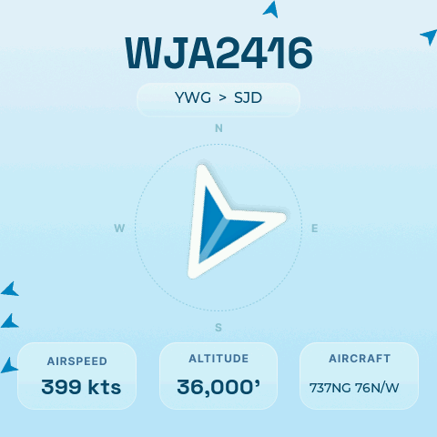

# ESP32 Nearest Plane Tracker

A real-time flight tracker built on the [Guition ESP32-S3-4848S040](https://github.com/mccahan/esp32-display-claude-base) 480x480 touchscreen. Displays the nearest aircraft overhead with its callsign, route, compass bearing, altitude, airspeed, and aircraft type — all updated live from ADS-B data.

Based on [esp32-display-claude-base](https://github.com/mccahan/esp32-display-claude-base), a starter project for building display applications on this hardware with Claude Code.



## Features

- **Live ADS-B tracking** via the [airplanes.live](https://airplanes.live) API, refreshed every 30 seconds
- **Compass arrow** with smooth rotation pointing toward the nearest aircraft
- **Split-flap animation** for callsign transitions
- **Route lookup** (origin/destination airports) via adsbdb.com
- **Minimap** showing up to 5 additional nearby aircraft
- **Dynamic search radius** (10-100 miles) that auto-adjusts based on local traffic density
- **Position interpolation** between API calls using aircraft velocity and heading
- **Web configuration UI** for location, WiFi, display schedule, and aircraft filters
- **OTA firmware updates** over WiFi
- **Screenshot API** to capture the display remotely

## Hardware

- **Board**: Guition ESP32-S3-4848S040 (ESP32-S3, 16MB flash, 8MB PSRAM)
- **Display**: 480x480 ST7701 RGB panel at 8MHz pixel clock
- **Touch**: GT911 capacitive touch controller
- **Framework**: Arduino + LVGL 8.x

## Getting Started

### Prerequisites

- [PlatformIO](https://platformio.org/) (CLI or IDE plugin)
- USB-C cable for initial flash

### Build & Flash

```bash
# Build and flash via USB
pio run -t upload

# OTA deploy (preferred after initial flash)
./scripts/deploy.sh <device-ip>

# Build only
pio run
```

### Configuration

On first boot the device creates a WiFi access point named **ESP32-Display**. Connect to it and open the device IP to configure:

1. **WiFi credentials** - connect the device to your network
2. **Location** - set latitude/longitude for distance and bearing calculations
3. **Display schedule** - optionally set on/off times for the backlight
4. **Aircraft filters** - hide private planes (where registration matches callsign)

You can also create `include/secrets.h` with default WiFi credentials:

```cpp
#define DEFAULT_SSID "YourNetwork"
#define DEFAULT_PASSWORD "YourPassword"
```

## Web API

The device serves a configuration dashboard and REST API at its IP address:

| Endpoint | Method | Description |
|----------|--------|-------------|
| `/` | GET | Configuration dashboard |
| `/api/info` | GET | Device stats (uptime, heap, firmware) |
| `/api/location` | POST | Set latitude/longitude |
| `/api/screenshot/capture` | POST | Capture current display |
| `/api/screenshot/download` | GET | Download screenshot as BMP |
| `/api/screenshot/view` | GET | View screenshot in browser |

## Project Structure

```
src/
  main.cpp          # Flight tracker logic, UI rendering, API calls
  web_server.cpp    # HTTP API and configuration endpoints
  screenshot.cpp    # Display capture to BMP
  *.c               # Compiled LVGL image/font assets
include/
  lv_conf.h         # LVGL configuration
  web_server.h      # Web server interface
assets/             # Source PNG files for arrow images
scripts/
  deploy.sh         # OTA build + upload + verify
  status.sh         # Get device IP/status via serial
```

## License

MIT
